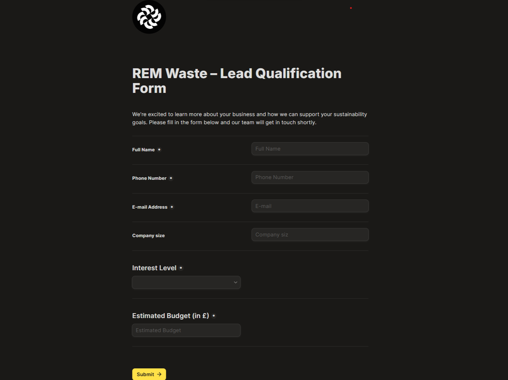
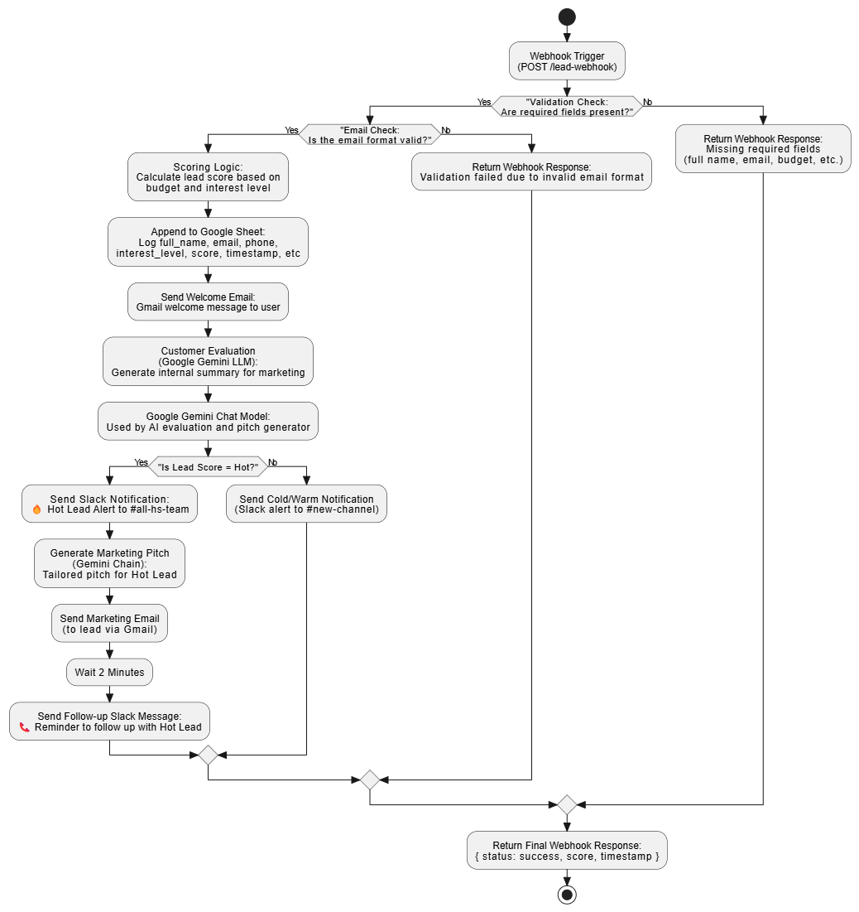
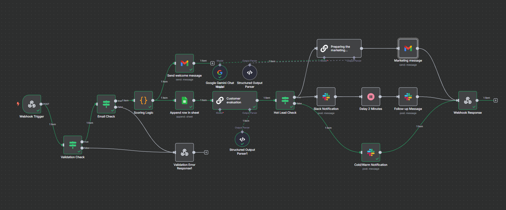
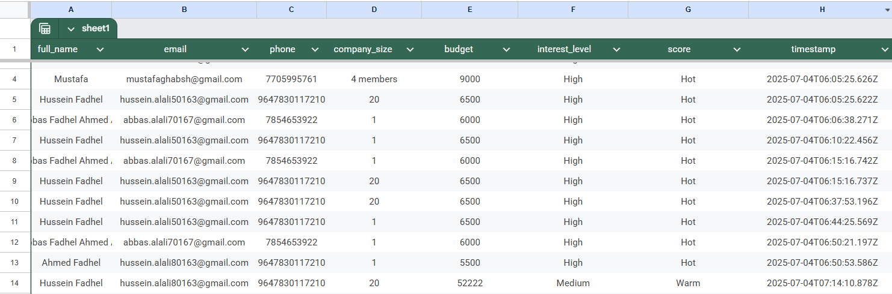
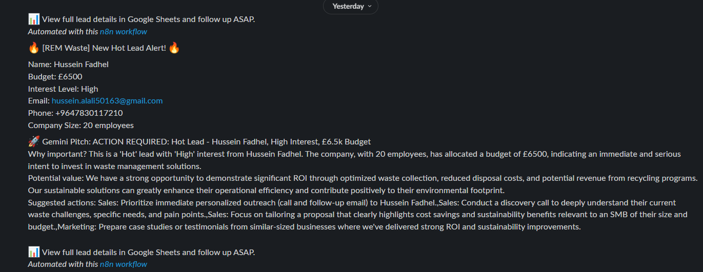
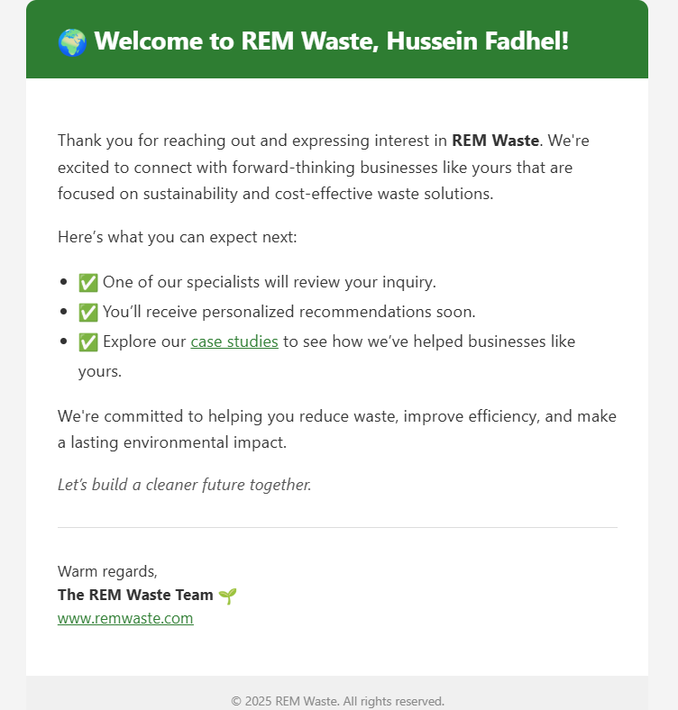
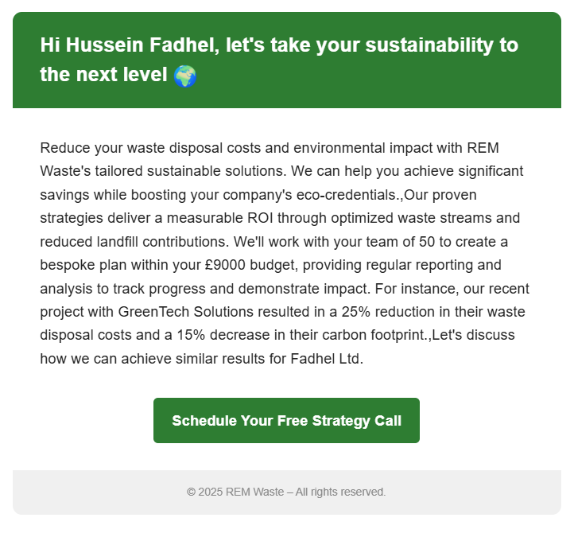

# 🚀 REM Waste – Lead Scoring & Notification Bot (n8n Workflow)

## 📌 Overview

With utmost appreciation for the opportunity to take part in REM Waste's technical challenge, I present this fully functional workflow built using **free-tier tools**. It automates the intake, qualification, and follow-up of marketing leads based on interest and budget — storing results in Google Sheets and notifying the team via Slack when a high-potential opportunity arises. This solution aligns with the specifications outlined in your brief and is designed with scalability, clarity, and operational efficiency in mind.

> 🌐 **Webhook Endpoint**: [Submit via webhook](https://husseinfadhelahmed.app.n8n.cloud/webhook/lead-webhook) &#x20;
>
> 🧾 **Form (Tally.so)**: [Lead Submission Form](https://tally.so/r/wdoMEo) &#x20;
>
> 📊 **Google Sheet**: [View Submitted Leads](https://docs.google.com/spreadsheets/d/1-HI1DydzqmIJVL6kUxY2hJI_WqaFjYLqatjpqGYGcBE/edit?usp=sharing)

> 📸 *Tally Form Preview:* 

---

## 🧩 Use Case Overview

> 🖼️ *Use Case Diagram:* 

The diagram highlights how this solution integrates into the sales workflow:

* Team members are instantly alerted based on the lead's potential.
* The system autonomously handles validation, scoring, storage, AI insights, and follow-up — reducing manual load and enhancing decision-making.

---

## ✅ Assessment Requirements (Checklist)

| Task                                       | Implemented |
| ------------------------------------------ | ----------- |
| Webhook trigger for lead input             | ✅ Yes       |
| Validation of required fields              | ✅ Yes       |
| Scoring logic for lead qualification       | ✅ Yes       |
| Store lead + score in Google Sheets        | ✅ Yes       |
| Slack notification for hot leads           | ✅ Yes       |
| Tally.so simulation form                   | ✅ Yes       |
| Delay + Follow-up notification             | ✅ Yes       |
| Documentation                              | ✅ Yes       |
| Extra features (Gemini AI, welcome emails) | ✅ Yes       |

---

## 🧠 Lead Scoring Logic

### 🔎 Logic Summary:

The scoring mechanism is based on both budget size and expressed interest level.

| Budget (£) | Interest Level | Score |
| ---------- | -------------- | ----- |
| > 5000     | High           | HOT   |
| 1000–5000  | High or Medium | WARM  |
| Else       | Any            | COLD  |

### 💻 JavaScript Code Snippet

```javascript
let score = "Cold";
if (budget > 5000 && interestLevel === "High") {
  score = "Hot";
} else if (
  (budget >= 1000 && budget <= 5000 && (interestLevel === "High" || interestLevel === "Medium")) ||
  (budget > 5000 && interestLevel === "Medium")
) {
  score = "Warm";
}
```

This logic is processed dynamically inside an `n8n Code` node after field mapping and value normalization.

---

## 🔄 Workflow Description (n8n)

> 📸 *Screenshot of Workflow:* 

The workflow consists of interconnected nodes covering intake, validation, scoring, enrichment, storage, and notifications.

### 📥 Input Trigger

* Initiated by `POST` requests via form or Postman.
* Required fields: `full_name`, `email`, `phone`, `company_size`, `budget`, `interest_level`.

### ✅ Validation & Scoring

* `If Node`: Validates field presence.
* `Email Regex`: Ensures correct email structure.
* `Code Node`: Maps values and determines lead score.

### 📝 Data Storage

* `Google Sheets`: Appends all enriched lead data + timestamp.

> 📸 *Google Sheet Entry Example:* 

### 🚨 Slack Notifications

* `Slack Node`: Delivers full lead info for HOT leads.
* Includes Gemini-generated insights (summary, value, action items).
* For **non-HOT leads (Warm or Cold)**, the message is sent to a **separate Slack channel** dedicated to general lead tracking and lower-priority nurturing. This segmentation helps the sales team focus attention where it matters most while still keeping track of all incoming opportunities.

* Includes Gemini-generated insights (summary, value, action items).

> 📸 *Slack Notification Example:* 

### ⏳ Bonus: Follow-up Reminder

* `Wait Node`: 2-minute delay.
* Triggers Slack reminder message for timely engagement.

### ✉️ Welcome Email

* `Gmail Node`: Sends a professionally branded HTML welcome email immediately after submission.

> 📸 *Email Preview:* 

---

## 🤖 Gemini AI Integration

> 📸 *Marketing Pitch Example:* 

| Use Case                  | Output                                                                   |
| ------------------------- | ------------------------------------------------------------------------ |
| **1. Internal Summary**   | Sales-ready headline + analysis + call-to-actions for team               |
| **2. Personalized Pitch** | Custom-tailored email pitch per lead based on size, interest, and budget |

**Why this matters:**

In addition to internal summaries, the workflow generates a dedicated marketing pitch tailored to each **HOT lead**. This pitch includes a concise, persuasive message that references the lead’s company size, declared interest, and allocated budget — all synthesized using Gemini AI. The output emphasizes REM Waste’s value proposition, showcases relevant success stories, and ends with a strong call to action (e.g., schedule a sustainability consultation or request a waste audit).

Such personalization ensures every high-potential lead receives a message that is timely, insightful, and aligned with their business context — helping REM Waste convert interest into tangible engagement.

* Converts form data into strategic actions.
* Equips the sales team with intelligent context for each hot lead.

---

## 📬 Manual Testing with Postman

For manual validation and testing:

* **POST URL**: `https://husseinfadhelahmed.app.n8n.cloud/webhook/lead-webhook`
* **Headers**: `Content-Type: application/json`
* **Body**:

```json
{
  "eventId": "20bba5a5-c89a-410e-bf35-235a0233125d",
  "eventType": "FORM_RESPONSE",
  "createdAt": "2025-07-04T04:56:38.462Z",
  "data": {
    "responseId": "Ek1q8oA",
    "submissionId": "Ek1q8oA",
    "respondentId": "GG86WZ",
    "formId": "wdoMEo",
    "formName": "REM Waste – Lead Qualification Form",
    "createdAt": "2025-07-04T04:56:38.000Z",
    "fields": [
      { "label": "Full Name", "value": "Hussein Fadhel" },
      { "label": "Phone Number", "value": "+9647830117210" },
      { "label": "E-mail Address", "value": "hussein.alali80163@gmail.com" },
      { "label": "Company size", "value": "20" },
      {
        "label": "Interest Level",
        "value": ["631abc3c-4a0f-4c5d-9307-68d0a55fc01d"],
        "options": [
          { "id": "bce1b282-46bf-4376-b546-e10738f7c18f", "text": "High" },
          { "id": "631abc3c-4a0f-4c5d-9307-68d0a55fc01d", "text": "Medium" },
          { "id": "3c7b7bc6-2e9f-4f14-9b66-ea3fdae2c287", "text": "Low" }
        ]
      },
      { "label": "Estimated Budget (in £)", "value": 52222 }
    ]
  }
}
```

---

## 🔍 Assumptions

* Tally.so provides structured field arrays.
* No CRM integration required as per assessment.
* Slack and Google Sheets used in free-tier capacity.

---

## ⚠️ Limitations & Future Improvements

| Limitation            | Suggestion                                    |
| --------------------- | --------------------------------------------- |
| No CRM sync           | Integrate with HubSpot, Zoho, or Pipedrive    |
| Slack-only alerting   | Add fallback via Twilio or email notification |
| No duplicate checking | Add email-based deduplication before append   |

---

## 🔚 Closing Note

This workflow was developed with sincere attention to the challenge scope, business practicality, and time constraint. I hope it reflects both my technical competence and appreciation for the opportunity to contribute to REM Waste.

Thank you for your kind consideration.

> Assessment: [Submit via form](https://forms.gle/Qwp8JgZ7xqyzuCKLA) &#x20;
> Contact: [hr@remwaste.com](mailto:hr@remwaste.com) | [www.remwaste.com](https://www.remwaste.com)
